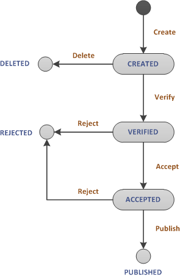

# _Requests_ Manager
Simple web-based application for managing _requests_ filed by users.

## Requirements
* When user files new _request_ he shall provide _name_ and _description_
* When user removes/rejects _request_ he shall provide _reason_ 
* User can change _description_ only when _request_ is in _CREATED_ or _VERIFIED_ state
* Each request shall have tracked _history of changes_
* _History of changes_ shall be viewable and support
    * Filtering by _name_ and _state_
    * Pagination (default: 10 _request_)
* When _request_ is _Published_ it shall have unique ID assigned to it
* _State_ of _request_ can be changed according to diagram

## Request Manager Core
Web service dedicated for requests management ([more](requests-manager-core/README.md))

## Request Manager Acceptance Tests
Cucumber project dedicated to validate Request Manager Core from clients perspective ([more](requests-manager-systemtests/README.md))

## Project progress

| Feature | Status |
| --------|:------:|
| Add new request | done |
| Change state of request (as defined in state diagram)| [x] |
| Require justification when deleting or rejecting request | [x] |
| Save history of request state changes | [x] |
| View details of single request | [x] |
| Change request description on CREATED and VERIFIED state | [] |
| Browse requests with paging and filtering | [] |
| Generate unique number during publication of request | [] |
| Store requests in database | [] |
| Create Dockerfile  for service | [] |
